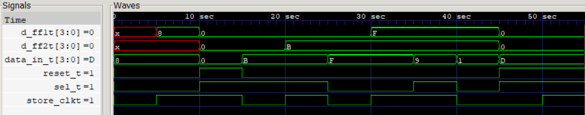

  
   
  <b> Waveform Analysis of Operand Storage System 

  
   
  <b> Output Terminal 

### Port Map - `r_a_mE.v`

| Port | Direction | Width |
|------|-----------|-------|
| `data_in` | input | [3:0] |
| `sel` | input | 1 |
| `store_clk` | input | 1 |
| `reset` | input | 1 |
| `d_ff1` | output | [3:0] |
| `d_ff2` | output | [3:0] |

> *Generated by [portmap](https://github.com/KARAN-D05/Computing_Machinery_from_Scratch/blob/main/portmap.nim)
> [Download Binary](https://github.com/KARAN-D05/Computing_Machinery_from_Scratch/releases/tag/v1.0.0)
> Nim port extractor*
