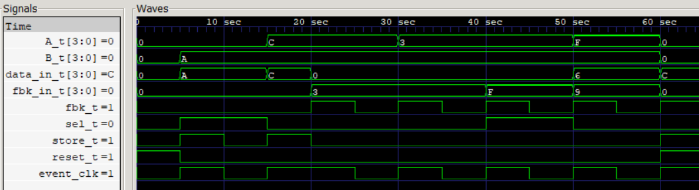
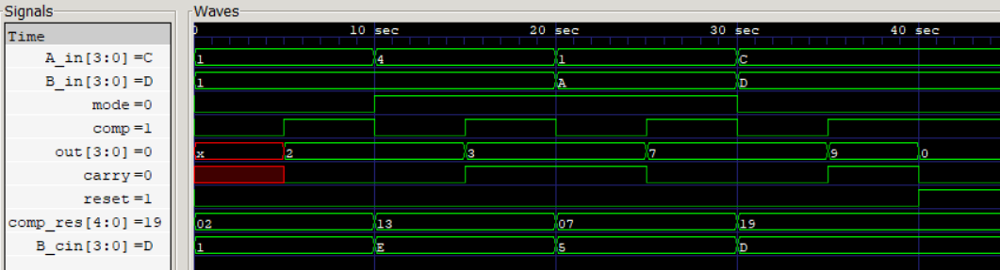
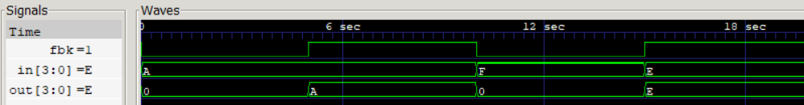

# 💻 RTL Implementation and Synthesis

## ✅Modules Implemented
- Operand Storage System
- Arithmetic Unit
- Feedback System

> src folder contains Verilog Source files & tb folder contains Verilog testbenches

  
   
  <b> Waveform Analysis of Operand Storage System 
  

  
   
  <b> Waveform Analysis of Arithmetic Unit 
  

  
   
  <b> Waveform Analysis of Feedback System 
  

