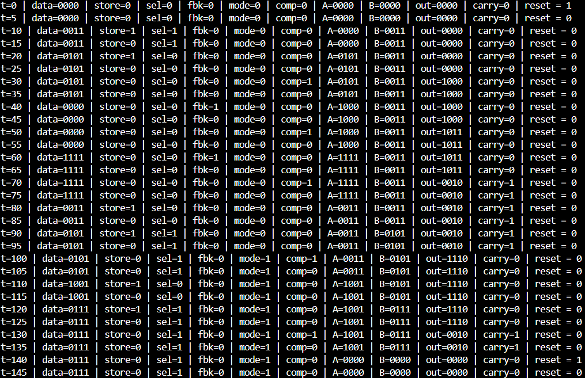

# 💻 RTL Implementation and Synthesis

## ✅Modules Implemented
- Operand Storage System
- Arithmetic Unit
- Feedback System
- RAM Engine

> src folder contains Verilog Source files & tb folder contains Verilog testbenches.

  
   
  <b> Waveform Analysis of RAM Engine 
  

  
   
  <b> Terminal output for RAM Engine Verification 
  

