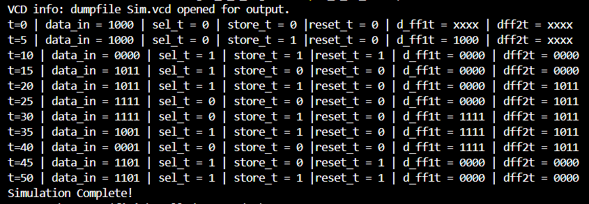

# 🔒Operand Storage System
- It is the combination of 2 sets of 4 D-Flip-Flops, 4 Demultiplexers, a Selector Pin and a Store Pin.
- Used to route and store the operands in the desired latch.

  
   
  <b> Testbench Waveform

## ⚙️Working Principle
- D-Flip-Flops
  - They are used to store the operand.
  - Two sets of 4-D Flip-Flops, thus giving the capability to store two 4-bit operands.
  
- Demultiplexer:
  - Routes the 4-Bit operand to the desired Latches.

- Selector Pin:
  - Based on its value the path to send the data is decided.

- Store Pin:
  - Stores the operand when it goes from 0 to 1.

  
   
  <b> Output Terminal
</p
