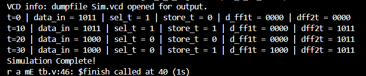

# 💻Verilog Implementation
- Implementing all the modules of the r_a_m in Verilog step by step for each version as it was developed.

## 🎯My Approach
- To rigorously test the modules using testbenches to ensure correctness before integration.

## 🛠️Tools Used
- Icarus Verilog -> Simulation
- GtkWave -> Waveform Analysis
- VS-Code -> Code editing and organization

## ✅Modules Implemented
- [Input Latch System](Input_Latch_System)

  
   
  <b> Output Terminal

