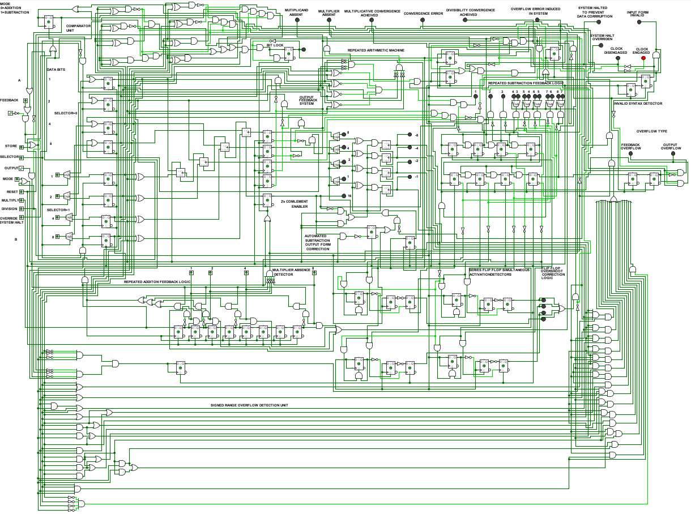

# ⚙️ Repeated Arithmetic Machine - V3

## 🧠About
- Full-fledged autonomous Repeated Arithmetic Machine. 
- Self-aware, self-correcting, and intelligent system with over 400 logic gates. 
- Developed iteratively from the base engine through V1 and V2 and other versions in between, now incorporating advanced automation and error handling.

  

## ✨Features
- Output feedback system 
- Overflow Error detection System and Overflow type indicators 
- Signed result handling 
- Automatic halting to prevent Data Corruption 
- Subtraction output form correction unit 
- Simultaneous activation detectors for series flip flops 
- Output overshoot correction logic 
- Multiplicative and Divisibility Convergence detectors 
- Edge cases handling like division and multiplication by zero 
- Invalid input form detector 
- Division,Multiplication,addition and subtraction

## 💡Significance
- Demonstrates a complete autonomous arithmetic computing system built from first principles using logic gates. 
- Showcases modular design, iterative development, and intelligent automation.

## 🧰How to Use Version 3 (r_a_mv3.circ)

1. **Install Logisim Evolution** 
   - Download and install from: [Logisim Evolution GitHub](https://github.com/logisim-evolution/logisim-evolution)

2. **Open the Circuit File** 
   - Navigate to the `RAM_V3` folder. 
   - Open `r_a_mv3.circ` in Logisim Evolution.

3. **Understand the Inputs and Outputs** 
   - Follow the input pins labeled for arithmetic operations. 
   - Version 3 handles all corrections and automations internally - no manual adjustments needed.

4. **Simulate the Machine** 
   - Apply different inputs to see fully autonomous operation. 
   - Observe automatic correction, feedback, and edge-case handling.

5. **Optional: Compare with Previous Versions** 
   - Explore [V1](../RAM_V1) and [V2](../RAM_V2) to see step-by-step evolution. 
   - Open `r_a_mEngine.circ` to study the base engine.

6. **Tips for Users** 
   - Watch output LEDs for feedback and automatic corrections. 
   - Refer to the README for details on features and supported operations. 
   - See [RAM_Engine](../RAM_Engine) for core engine functionality.
