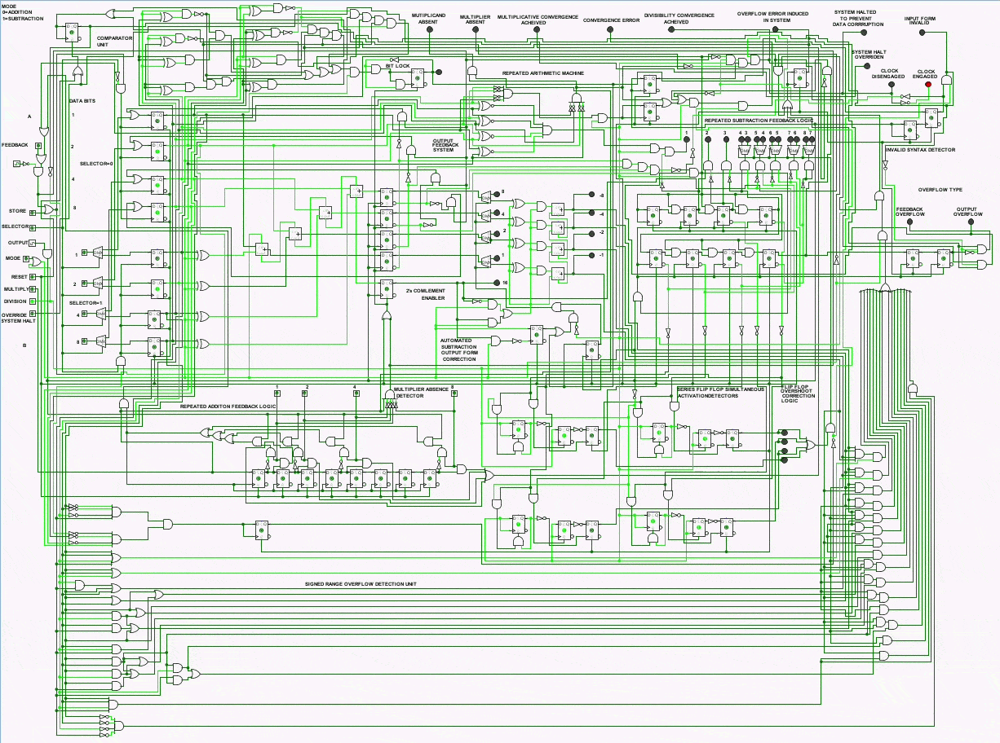
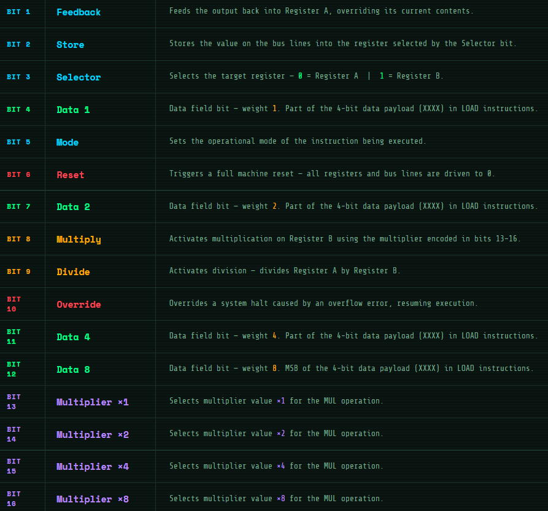
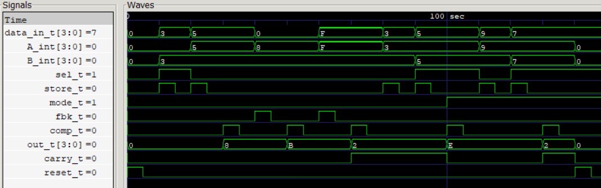
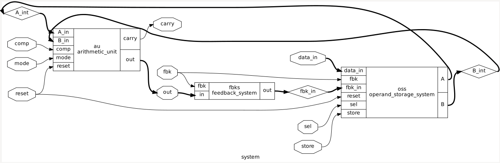
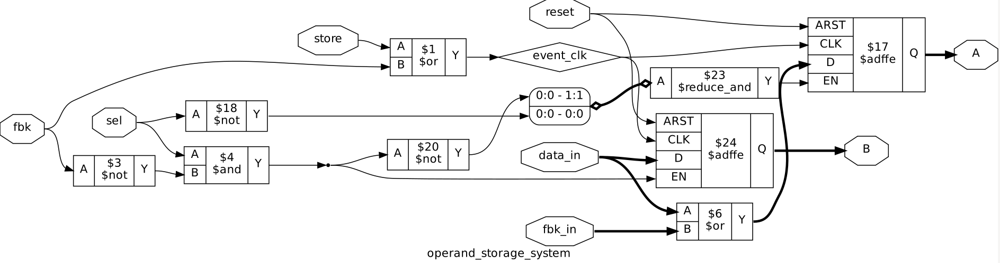
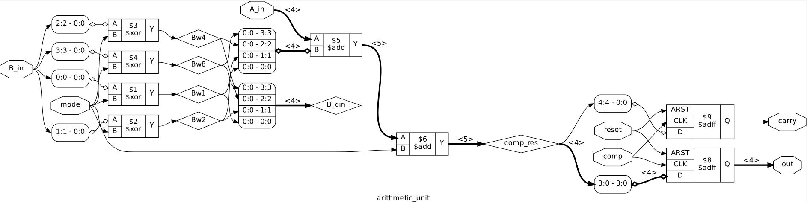

# 🧰 Computing Machinery from Scratch
## 🧮 4-Bit Feedback-Driven Stored-Program Machine

<p align="center">
  
  <br>
  <sub><b>🧩 R_A_MV3 </b> - self correcting and automated arithmetic computing machine. (Performing Division)</sub>
</p>


This project began from a simple idea: what if the output of an arithmetic operation could be fed back into the input? 
The first prototype was very basic - it could only perform addition and take feedback. But as I explored the possibilities, I
kept improving the machine:

- [V0](RAM_Engine) -> Proof of concept
- [V1](RAM_V1) -> Manual Arithmetic Logic and 2's complement handling
- [V2](RAM_V2) -> Low level of Automation
- [V3](RAM_V3) -> Self Correction, State Based Control and high level of automation
- [V4](RAM_V4) -> Sequential execution of Instructions stored in memory

Through each iteration, the goal was simple: make the machine **smarter, more autonomous, programmable and more reliable**.  

Today, the `Repeated Arithmetic Machine`(name of the computing machine) is a modular, 4-bit arithmetic computing system with feedback-driven control, automation, error handling and ability to execute programs - a full evolution from a simple prototype to a fully autonomous machine.

💡[Machine Schematics - From Idea to Implementation(V1-V3)](Images/RAM_Project_Evolution.pdf)

## ⚙️ Implementation Stack


## 🛠️ Toolchain


## 🚀 r_a_mv4(Stored Program Architecture)

<p align="center">
  
  <br>
  <sub><b>⚙️ R_A_MV4 </b> - Complete system with sequential program execution.</sub>
</p>

This stage represents a significant step towards understanding and recreating principles behind early programmable computers.
This is done in order to understand how instructions can be stored in memory and executed sequentially.
The development of this version 4 is a hands on exploration of how program memory, sequencing and control logic forms basis of the **Stored Program Execution**.
 
  <p align="center">
  
  <br>
  <sub><b>🧠 Program Active Memory</b> - Memory to store Machine code program and interact with machine by making code flow through it.</sub>
</p>

**📈 Progress Made:-**
- Developed instruction format
- Built Memory modules that stores the machine code instructions
- Developed units that facilitate Controlled flow for execution of instructions
- Successfully demonstrated programs like loading data, then adding them, then taking a feedback and subtracting it from some other data
- Operations that would take manual intervention have been automated through machine code programming

## 🧩 Machine Code Instruction Format
<p align="center">
  
  <br>

🔬 [More About technical details](RAM_V4/Readme.md)

## 👉Verilog Implementation:

- [RAM_Engine](RAM_Engine/RAM_Engine_Verilog)

<p align="center">
  
  <sub> Waveform Analysis of RAM Engine </sub>
</p>

## 🔬 RTL Synthesis, Timing and Power Analysis

To verify hardware realizability, all modules were synthesized using Yosys, technology mapped to the Sky130HD standard-cell library, and analyzed using static timing and power estimation. The resulting gate-level netlists were used to compare architectural complexity, silicon area, timing characteristics, and power consumption across the project.

> Technology: Sky130HD

### 📊 Implementation Metrics Comparison

| Module                 | Cells | Area | Critical Path Delay | Power |  Key Hardware Structures                                          
| ---------------------- | ----- | ---- |---------------- | ----------- | --------------------------------------- | 
| Operand Storage System | 9 | 337.824 µm² | 0.64 ns | 57.3 µW | 2 DFFs (Enable + Async Reset), 1 AND, 2 OR, 3 NOT, 1 Reduction-AND |
| Arithmetic Unit | 8     | 376.6112 µm² | 1.56 ns | 174 µW | 2 DFFs (Async Reset), 4 XOR, 2 Adders |
| Feedback System | 4     | 25.024 µm² | 0.10 ns | 3.24 µW |4 AND |
| RAM Engine | 21 | 718.1888 µm² | 1.99 ns | 186 µW | 2 Adders, 2 DFFs (Async Reset), 2 DFFs (Enable + Async Reset), 5 AND, 3 NOT, 2 OR, 1 Reduction-And, 4 XOR  |

## 🏆 Implementation Highlights

| Category                  | Result                                                           |
| ------------------------- | ---------------------------------------------------------------- |
| Smallest Area             | Feedback System (25.024 µm²)                                     |
| Largest Area              | Arithmetic Unit (376.6112 µm²)                                   |
| Lowest Power              | Feedback System (3.24 µW)                                        |
| Highest Power             | Arithmetic Unit (174 µW)                                         |
| Fastest Module            | Feedback System (0.10 ns Critical Path)                          |
| Slowest Module            | Arithmetic Unit (1.56 ns Critical Path)                          |
| System Critical Path      | RAM Engine (1.99 ns)                                             |
| Estimated System Fmax     | ~502 MHz (Fmax ≈ 1 / 1.99 ns)                                    |
| Most Dominant Module      | Arithmetic Unit (52% of area, 94% of power)                      |

<p align="center">
  
  <sub> RTL Synthesis of RAM Engine </sub>
</p>

<p align="center">
  
  <sub> RTL Synthesis of Operand Storage System </sub>
</p>

<p align="center">
  
  <sub> RTL Synthesis of Arithmetic Unit </sub>
</p>

## 🛠️ Hardware-First Instruction Set Design
- RAM follows a hardware-first design philosophy in which the instruction set emerged from the machine's native computational mechanisms rather than being specified independently and implemented afterward.
- Each instruction corresponds directly to a dedicated hardware primitive or subsystem, such as addition, subtraction, feedback-driven computation, multiplication, division, fault recovery, or machine reset.
- Unlike architectures that rely on complex control sequencing or microcoded decomposition of instructions, RAM exposes its fundamental hardware capabilities directly through the ISA.
- While not a textbook RISC architecture, the system shares a reductionist spirit: instructions represent the machine's natural operations rather than abstractions translated into lengthy internal execution sequences.
- In this sense, the software vocabulary of RAM was discovered from the hardware itself.

## ✅ Assembly & Assembler - Built
- Mapping machine code to custom assembly language
- Assembly language for the machine code instructions
- Assembler to convert from assembly code to machine code
- Here is the Assembler Project, [Check this out](https://github.com/KARAN-D05/Assembler)

## ⬇️ Download This Repository

### 🪟 Windows
Download → [download_repos.bat](./download_repos.bat)
``` 
Double-click it and pick the repo(s) you want.
```

### 🐧 Linux / macOS
Download → [download_repos.sh](./download_repos.sh)
```
bash

chmod +x download_repos.sh
./download_repos.sh
```

> Always downloads the latest version.

## 📜License:
- Source code, HDL, and Logisim circuit files are licensed under the MIT License.
- Documentation, diagrams, images, and PDFs are licensed under Creative Commons Attribution 4.0 (CC BY 4.0).
