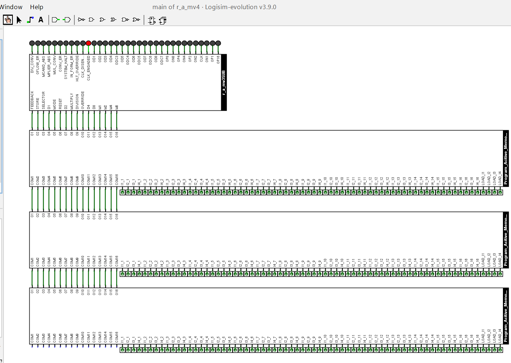
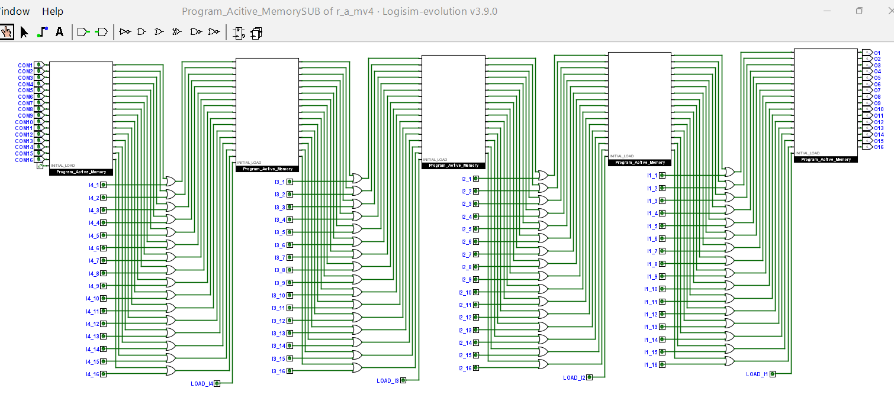
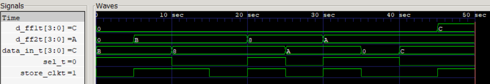

# 🧰 Computing Machinery from Scratch

  
   
  <b>🧩 R_A_MV3 </b> - self correcting, self aware and automated arithmetic computing machine.

This project began from a simple idea: what if the output of an arithmetic operation could be fed back into the input? 
The first prototype was very basic - it could only perform addition and take feedback. But as I explored the possibilities, I
kept improving the machine:

- [V0](RAM_Engine) -> Proof of concept
- [V1](RAM_V1) -> Manual Arithmetic Logic and 2's complement handling
- [V2](RAM_V2) -> Low level of Automation
- [V3](RAM_V3) -> Self Correction, Self-awareness and high level of automation
- [V4](RAM_V4) -> Sequential execution of Instructions stored in memory

Through each iteration, the goal was simple: make the machine **smarter, more autonomous, programmable and more reliable**.  

Today, the Repeated Arithmetic Machine(name of the computing machine) is a modular, 4-bit arithmetic computing system with feedback-driven control, automation, error handling and ability to execute programs - a full evolution from a simple prototype to a fully autonomous machine.

💡[Machine Schematics - From Idea to Implementation(V1-V3)](Images/RAM_Project_Evolution.pdf)

## 🚀 Latest Development --> r_a_mv4(Stored Program Architecture)

  
   
  <b>⚙️ R_A_MV4 </b> - Complete system with sequential program execution.

This stage represents a significant step towards understanding and recreating principles behind early programmable computers.
This is done in order to understand how instructions can be stored in memory and executed sequentially.
The development of this version 4 is a hands on exploration of how program memory, sequencing and control logic forms basis of the **Stored Program Execution**.

**📈 Progress Made:-**
- Developed instruction format
- Built Memory modules that stores the machine code instructions
  
  

  
   
  <b>🧠 Program Active Memory</b> - Memory to store Machine code program and interact with machine by making code flow through it.

- Developed units that facilitate Controlled flow for execution of instructions
- Successfully demonstrated programs like loading data, then adding them, then taking a feedback and subtracting it from some other data
- Operations that would take manual intervention have been automated through machine code programming

🔬 [More About technical details](RAM_V4/Readme.md)

## 👉HDL Implementation:
- **`Translating all modules into verilog and eventually implementing the entire machine.`**
--------------------------------------------------------------------------------------------------------------------------------------------------------------------------------------------------------------------
- RAM_Engine:
  - [Operand_Storage_System](RAM_Engine_Verilog/Operand_Storage_System) 

  
   
  <b> Waveform Analysis of Input Latch System 

## 🛠️ Upcoming Versions:
- Assembly language for the machine code instructions
- Assembler to convert from assembly code to machine code
- Here is the Assembler Project, [Check this out](https://github.com/KARAN-D05/Assembler)
